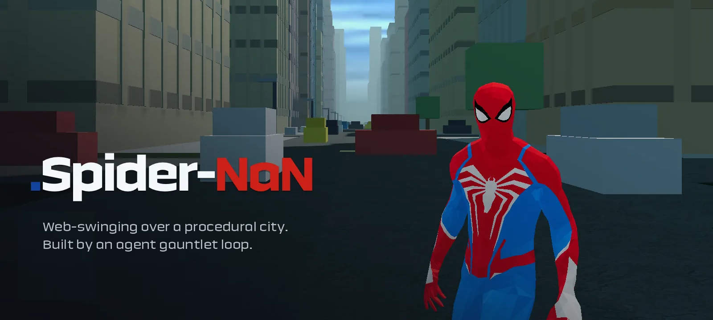

# Spider-NaN

A web-swinging game over a procedural city, built with **Three.js + TypeScript + Vite**, shipped alongside a **presentation site** that documents the entire construction process, failures included.

Play it, and read every verdict, capture and metric behind it, at **<https://nan.builders>**.

---

## Who built what

The game was written by an **AI agent gauntlet loop**: a builder agent implements a system, an independent critic agent judges the *rendered result* against real reference footage, and sends the builder back with named weaknesses. Build → render → inspect → critique → improve.

The critic never reads the source. It only sees what comes out: screenshots, frame bursts and live telemetry from `window.__GAUNTLET__`, compared against reference frames, scored against quantified PASS/FAIL thresholds fixed before the work started.

| Role | Model | What it did |
|---|---|---|
| Builder | **DeepSeek V4 Flash** | Procedural city, swing physics, camera, FX, visual polish |
| Critic | **Opus 5** | Frame-by-frame comparison against reference, binary PASS/FAIL with evidence |
| Orchestrator | **GLM 5.2** | Architectural decisions, coordination of the flow |
| Voice | **MiniMax** | 5 voice lines with i18n subtitles |

Arcade scoring, the photographic sky and the final polish were done by hand, outside the agents.

## The verdicts

The critic said FAIL 17 times. That is the part worth publishing.

| Subsystem | Iterations | Verdict | Key change |
|---|---|---|---|
| City Iter2 | 2 | 5 PASS / 2 FAIL | Instance overflow, proportions, TOD ramps |
| Buildings Visual | 1 | 4 PASS / 10 FAIL | Fog deleted the city, blank facades, inert models |
| Buildings Perf | 1 | All PASS + 1 leak fix | GPU buffer leak found and fixed |
| City Atmosphere | 2 | 21 PASS / 2 PARTIAL | Fog continuity, facades, tower palette |
| City Life | 2 | 8 PASS / 0 FAIL | Buffer leak plateaued, heap honest |
| Animation Iter1 | 1 | 2 PASS / 5 FAIL | Flip leak, unreadable variants |
| Animation Iter2 | 2 | 6 PASS / 0 FAIL | Flip fixed, silhouettes, idle alive |

**Total: 46 PASS · 17 FAIL · 2 PARTIAL.**

## Where it landed

| Measure | Value | Measure | Value |
|---|---|---|---|
| Frame rate | **120 FPS** | Draw calls | **73** |
| Frame time (avg) | **8.33 ms** | Triangles | **581k** |
| Frame time (p95) | **9.1 ms** | JS heap | **23 MB** |
| Load time | **42 ms** | Console errors | **0** |
| Buildings | **486 → 563** | Max height | **245 m** |
| Hand-authored poses | **912** | Determinism | **PASS** |

Determinism means the same seed produces a byte-identical city. `npm run capture` regenerates all of it.

## Assets

Not everything here is generated code, and it is worth being precise about it. The game uses a glTF character model, a photographic sky, music and audio, and the five MiniMax voice lines. Everything else, meaning the city, the swing physics, the camera, the effects and the UI, is code produced inside the loop. `~12k` lines across `32` TypeScript files, in `74` commits.

---

## How to run

### Docker (recommended)

```bash
docker build -t spider-nan .
docker run -p 8080:80 spider-nan
```

- Presentation (landing page) → <http://localhost:8080/>
- Game → <http://localhost:8080/game>

### Local development

```bash
npm ci
npm run dev      # http://localhost:5173
```

- Presentation → <http://localhost:5173/>
- Game → <http://localhost:5173/game/>

### Production build

```bash
npm run build    # tsc --noEmit && vite build → dist/
npm run preview  # game at http://localhost:4173/game/
```

> `vite build` emits only the game (under the `/game/` base), so `npm run preview` serves the game and not the presentation. The final `/` + `/game` layout is assembled in the Dockerfile, which moves the bundle to `dist/game/` and drops `presentacion/index.html`, `captures/`, `docs/` and `reference-pack/` at the root.
>
> `npm run dev` mirrors that final layout: a dev-only plugin in `vite.config.ts` serves the presentation at `/` and the media directories at the root, so the presentation's absolute paths (`/game/assets/…`, `/captures/…`) resolve the same in dev as in the container.

---

## Controls

| Action | Key |
|---|---|
| Steer / move | `WASD` |
| Look | Mouse |
| Shoot web | `Left click` or `E` |
| Dash / boost | `Right click` or `Shift` |
| Dive | `S` or `Ctrl` |
| Jump / launch | `Space` |

---

## The presentation

The landing page at `/` (source: `presentacion/index.html`) walks through the whole process: both construction loops, the procedural city, the day/night cycle, animation comparisons against reference footage, and the metrics and evidence captured automatically on every iteration. (UI available in Spanish and English — toggle it in the nav.)

---

## Structure

```
index.html            game entry point (served at /game/)
src/                  game source
  core/               Game, Renderer, HUD, telemetry
  city/               procedural generation, sky, day/night
  swing/              swing physics and anchors
  camera/  input/  fx/  score/  ui/  i18n/
public/assets/        model, textures, audio, video
presentacion/         presentation site (served at /)
captures/ docs/ reference-pack/   media referenced by the presentation
docs/animation/       animation comparisons against reference footage
docs/ui/              menu, modes, settings and pause screens
vite.config.ts        base '/game/' + dev-only mirror of the served layout
Dockerfile            multi-stage build → nginx (/ = presentation, /game = game)
```

---

## License

MIT — © 2026 Adrián Sáez. See [LICENSE](LICENSE).
